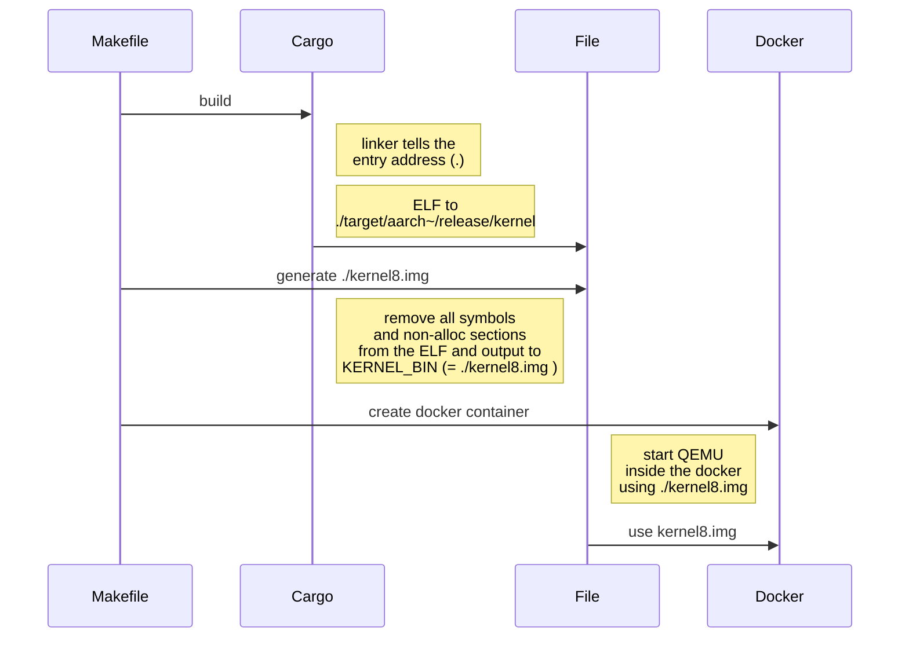
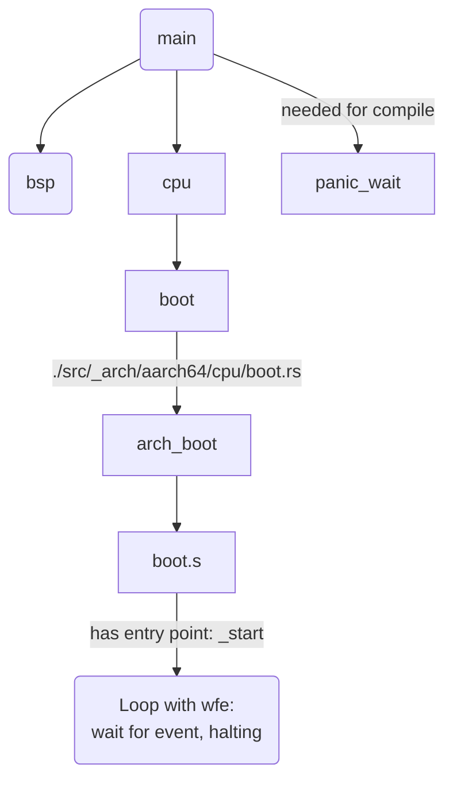

## Memo

This is for organizing my understanding on this project structure. 

Might be wrong.

### Vocab

- BSP: Board Support Package.
  - contains target board specific definitions and functions.
- 
---

`TARGET=aarch64-unknown-none-softfloat`

`KERNEL_BIN=./kernel8.img`

```sh
RUSTFLAGS="-C link-arg=-Tsrc/bsp/raspberrypi/link.ld -C target-cpu=cortex-a53 -D warnings -D missing_docs

cargo rustc --target=$(TARGET) --features bsp_rpi3 --release
```

```toml
[[bin]]
name = "kernel"
path = "src/main.rs"
```
-> ELF: `target/$(TARGET)/release/kernel`



